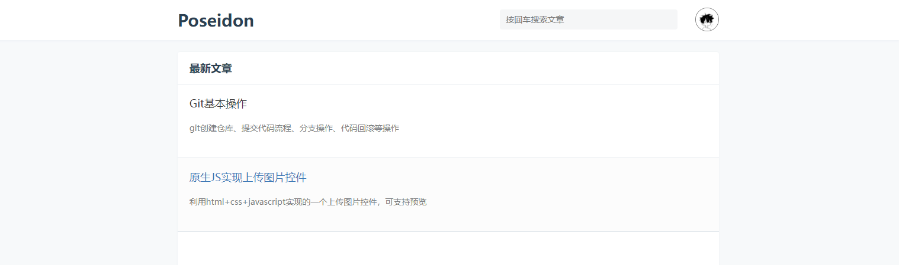
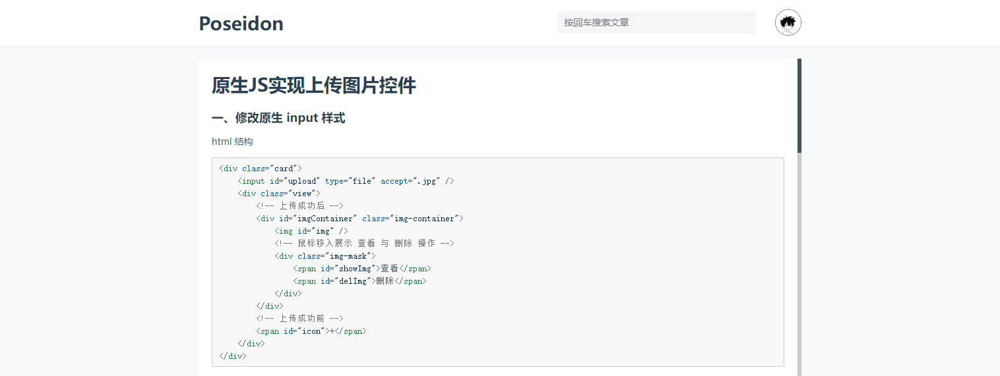

# Poseidon

## 介绍
一款只有前端展示的博客网站。不需要后端接口，不关注点赞数和阅读数，只专注于记录个人的学习历程。

## 效果展示



## 运行
```
npm install

npm run dev
```

## 新增文章
在`markdown/article`目录下新增`.md`文件，注意：文章的标题和描述使用了`yaml-front-matter`插件解析
```
---
title: 这里写文章标题
description: 这里写文章描述
---
```

文章写完之后运行一下构建脚本
```
node markdown/index.js
```

